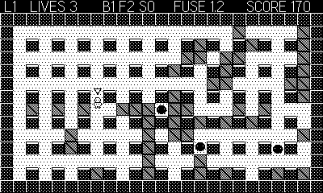

# Blast

Single-screen bomb-the-maze arcade in the Bomberman mold. Clear all five
levels by trapping the beasts in your blasts — without trapping yourself.

## Controls

- **D-pad** — move (4-way, with corner assist)
- **Ⓐ** — drop a bomb
- **Crank** — fuse dial: crank up for a hair-trigger (1.2s), down for a
  long burn (3.6s). Shown live in the HUD.

## Rules

- Bombs blast in a cross; crates burn, pillars and walls stop the flame.
- Bombs chain-detonate each other. A fresh bomb is walkable until you
  step off it — then it hardens.
- Crates sometimes drop powerups: **B** more bombs, **F** longer flames,
  **S** speed boots. Powerups burn if flamed, and upgrades are lost when
  you die.
- Puffs wander; hounds hunt you down. Touching anything (including your
  own flame) costs a life. Clear every enemy to advance; five levels wins.
