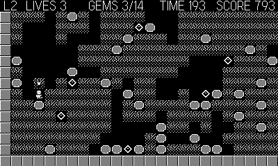

# Burrow

Scrolling Boulder-Dash-style digger — the first Tiles game on the camera
module. Tunnel through a 640x448 cave, bank enough gems to open the
exit, and respect gravity.

## Controls

- **D-pad** — dig / walk cell by cell; push rocks sideways into open
  space
- **Crank** — pan the camera up and down to survey the shaft (springs
  back when released)
- **Ⓐ** — start / continue

## Rules

- Rocks and gems fall when undermined and roll off rounded piles.
  Standing under a rock is safe — it rests on your helmet — but anything
  already falling when it reaches you is fatal. Digging straight down
  beneath a rock invites it to follow you.
- Falling gems kill just as dead as rocks do.
- Bank the gem quota (shown in the HUD) to open the exit door, then
  reach it before the clock runs out. Three caves, freshly carved every
  time, and a time bonus for fast clears.
