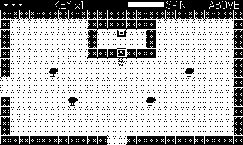

# Relic

Screen-flip action RPG in the Zelda mold: an overworld of linked rooms, a
locked dungeon, keys, a boomerang, a boss, and the Relic at the bottom.

## Controls

- **D-pad** — move
- **Ⓐ** — sword stab (also: new quest at the title)
- **Ⓑ** — throw the boomerang once you've found it (stuns enemies,
  fetches pickups, flies over water; also: continue at the title)
- **Crank** — wind it to charge a spin attack; releases on a full wind,
  hitting everything around you for double damage

## Rules

- The world is six overworld rooms and a four-room dungeon; walk off an
  edge gap to flip rooms. The game saves at every room transition —
  continue resumes where you were with full hearts.
- Find the key hidden among the ponds, unlock the dungeon mouth in the
  north-east hills, and descend the stairs.
- Below: a second key, a locked boss door, and the boss — it lumbers at
  you and calls blobs. Sword it down, take the Relic, and the land is
  bright again.
- Blobs wander, skeletons chase, sentries shoot. A heart container in the
  north-west rocks raises your maximum.
