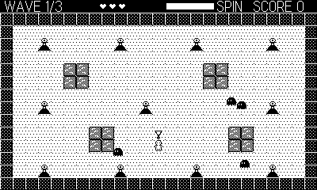

# Spirit

Single-screen 4-way shooter in the KiKi KaiKai / Pocky & Rocky mold.
Hold the shrine courtyard against eight waves of yokai.

## Controls

- **D-pad** — move (8-way); your talismans fly the way you last walked
  (4-way)
- **Ⓐ** — throw talismans (hold to autofire)
- **Crank** — spin it to bank a wand sweep (meter in the HUD); the sweep
  releases automatically at a full wind, killing everything nearby and
  clearing enemy shots

## Rules

- Ghosts drift at you and float over cover; spitters lob aimed shots
  (they stop on lanterns, not ponds); dashers wind up and charge.
- Lanterns are cover. Ponds block walking but not shots.
- Three hearts, generous invincibility after a hit. Clear all waves to
  bring the shrine peace.
